# Porto-Cel-Store

<!DOCTYPE html>
<html lang="pt-br">
<head>
<meta charset="UTF-8">
<meta name="viewport" content="width=device-width, initial-scale=1.0">
<title>Porto Cel</title>

<link href="https://fonts.googleapis.com/css2?family=Orbitron:wght@600&family=Poppins:wght@300;400;600&display=swap" rel="stylesheet">

</head>
<body>

<!-- Fundo Neon -->

    

    

    

    

    

    

<!-- Conteúdo principal -->

    <a href="https://wa.me/5592986319253" target="_blank">📱 WhatsApp</a>
    <a href="https://instagram.com/porto.cell_" target="_blank">📸 Instagram</a>

<header>
    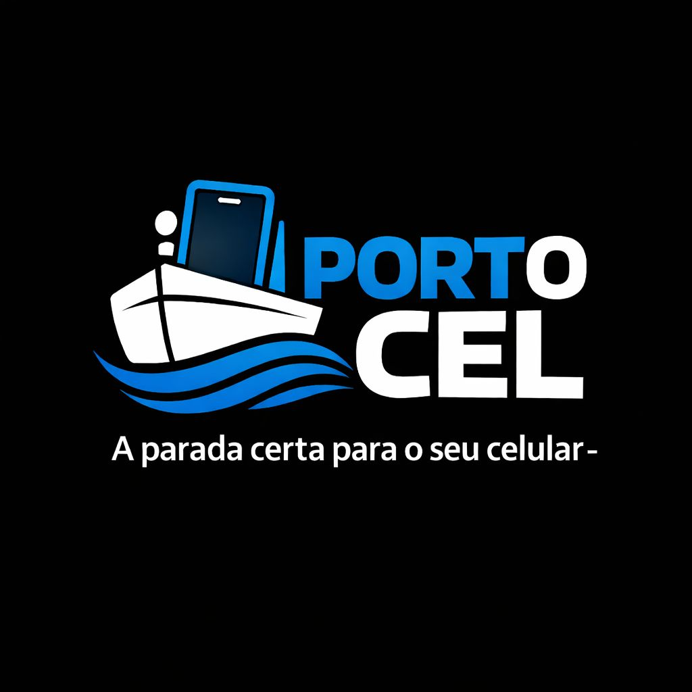
    <h1>Porto Cel</h1>
    
A melhor loja e assistência para seu celular!

</header>

    <h2>Tecnologia e acessórios premium</h2>
    
Capinhas, carregadores, fones e muito mais!

<h2>🎧 Fones</h2>
<section class="produtos">
    

        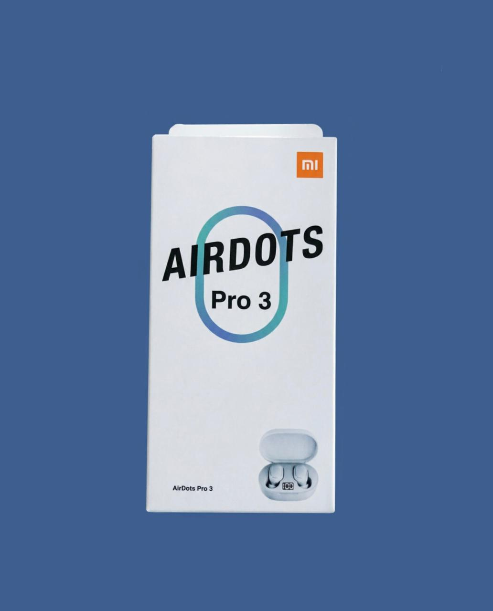
        <h3>Fone AirDots Pro 3 Branco</h3>
        
R$ 45,00

        <a href="https://wa.me/5592986319253?text=Olá,%20quero%20comprar%20o%20Fone%20Bluetooth%20da%20Porto%20Cel" target="_blank">
            <button>Comprar</button>
        </a>
    

    

        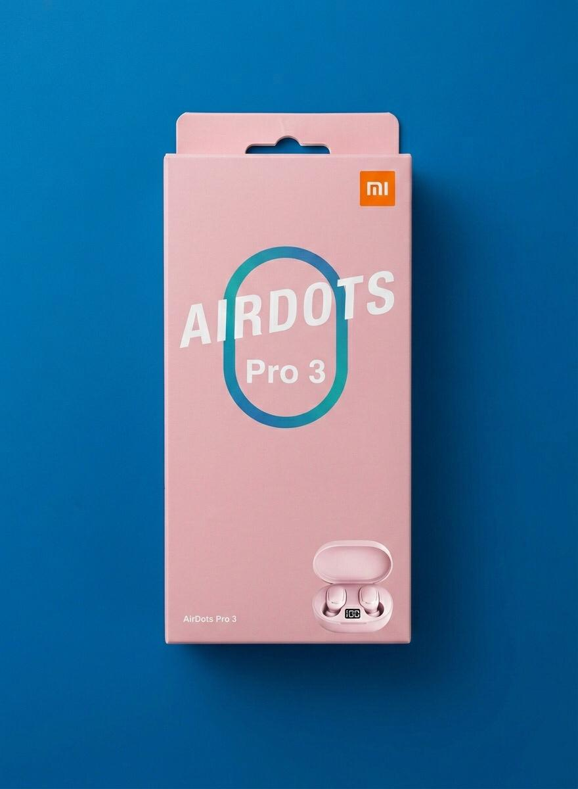
        <h3>AirDots Pro 3 rosa</h3>
        
R$ 45,00

        <a href="https://wa.me/5592986319253?text=Olá,%20quero%20comprar%20o%20Headset%20Gamer%20da%20Porto%20Cel" target="_blank">
            <button>Comprar</button>
        </a>
    

    

        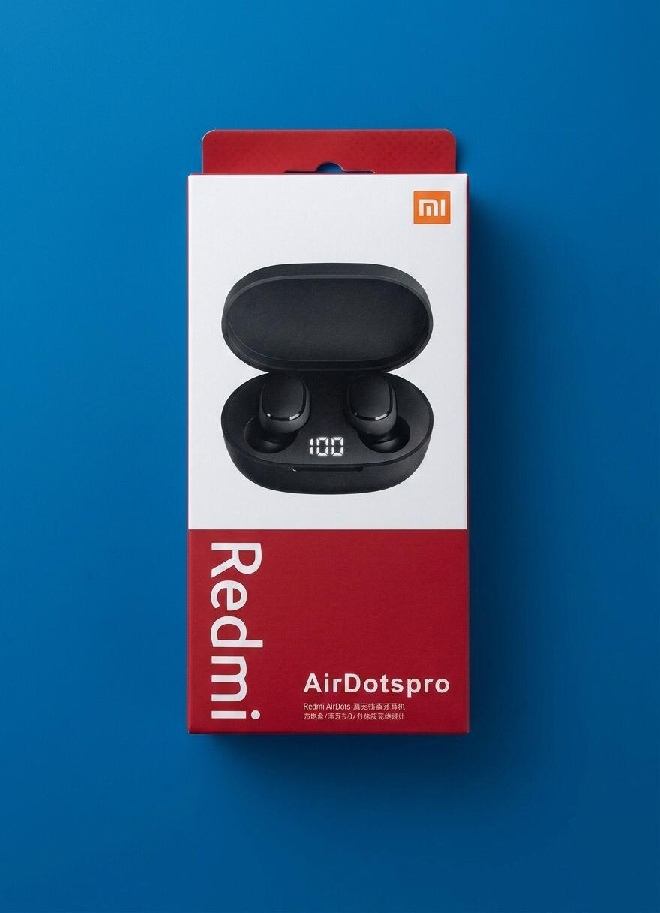
        <h3>Fone AirDots Pro </h3>
        
R$ 40,00

        <a href="https://wa.me/5592986319253?text=Olá,%20quero%20comprar%20o%20Fone%20Bluetooth%20da%20Porto%20Cel" target="_blank">
            <button>Comprar</button>
        </a>
    

</section>

<h2>🔌 Carregadores</h2>
<section class="produtos">
    

        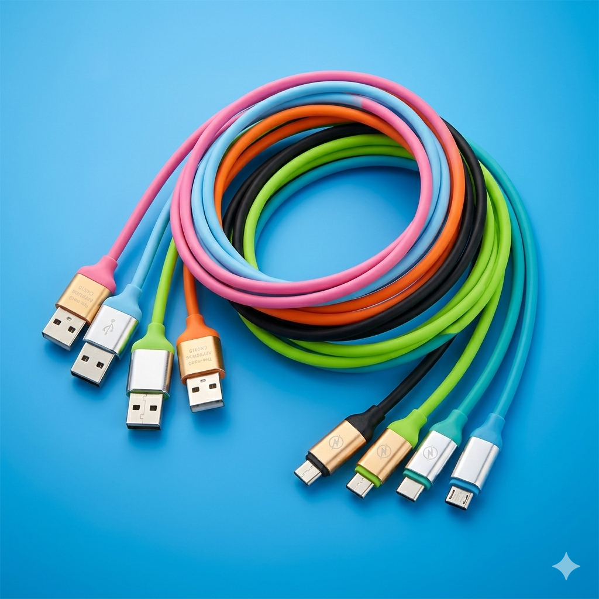
        <h3>Cabo USB-Iphone</h3>
        
R$ 15,00

        <a href="https://wa.me/5592986319253" target="_blank"><button>Comprar</button></a>
    

    

        
        <h3>Cabo USB-C</h3>
        
R$ 15,00

        <a href="https://wa.me/5592986319253" target="_blank"><button>Comprar</button></a>
    

    

        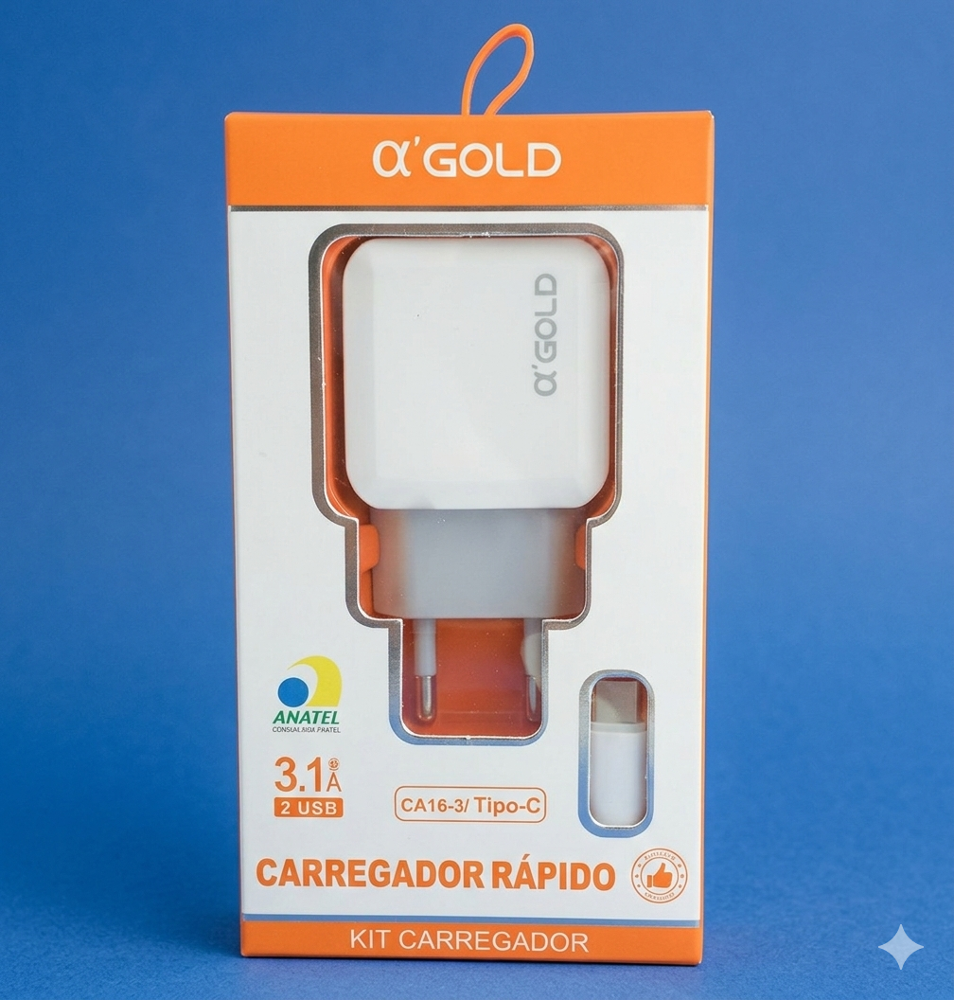
        <h3>Carregador completo Iphone</h3>
        
R$ 35,00

        <a href="https://wa.me/5592986319253" target="_blank"><button>Comprar</button></a>
    

    

        
        <h3>Carregador completo TIPO-C</h3>
        
R$ 35,00

        <a href="https://wa.me/5592986319253" target="_blank"><button>Comprar</button></a>
    

    

        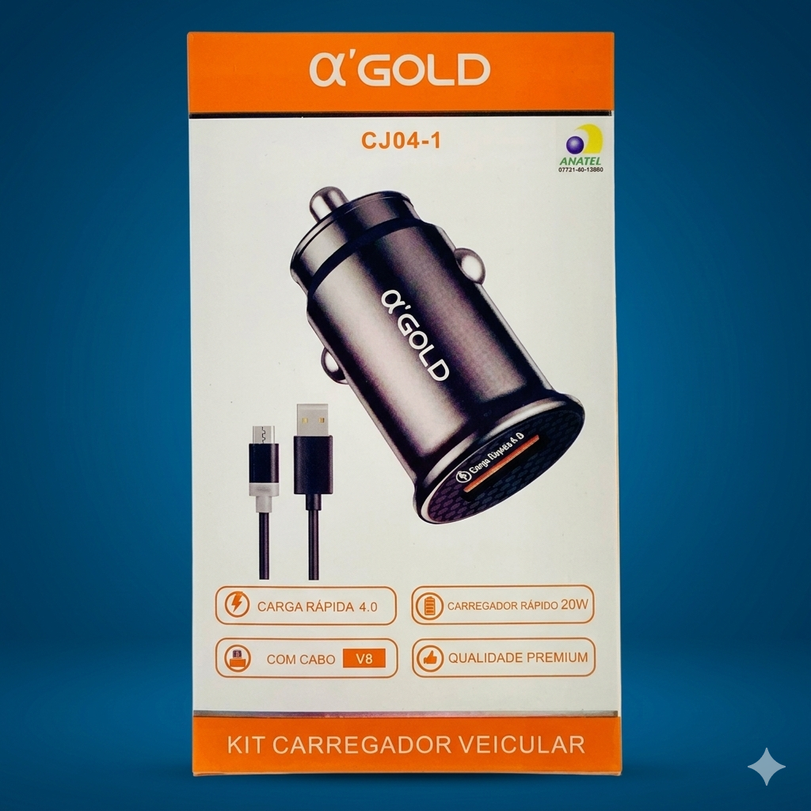
        <h3>Carregador Veicular</h3>
        
R$ 20,00

        <a href="https://wa.me/5592986319253" target="_blank"><button>Comprar</button></a>
    

</section>

<h2>📱 Capinhas</h2>
<section class="produtos">
    

        
        <h3>Capinha Verde escura iphone 12</h3>
        
R$ 25,00

        <a href="https://wa.me/5592986319253" target="_blank"><button>Comprar</button></a>
    

    

        
        <h3>Capinha Vermelha Iphone 12</h3>
        
R$ 25,00

        <a href="https://wa.me/5592986319253" target="_blank"><button>Comprar</button></a>
    

    

        
        <h3>Capinha Amarela Iphone 12</h3>
        
R$ 25,00

        <a href="https://wa.me/5592986319253" target="_blank"><button>Comprar</button></a>
    

    

        
        <h3>Capinha Lilás Iphone 12</h3>
        
R$ 25,00

        <a href="https://wa.me/5592986319253" target="_blank"><button>Comprar</button></a>
    

</section>

<h2>🦾 Acessórios</h2>
<section class="produtos">
    

        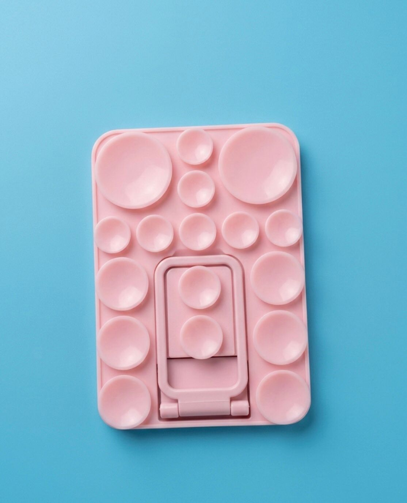
        <h3>Ventosa rosa</h3>
        
R$ 20,00

        <a href="https://wa.me/5592986319253" target="_blank"><button>Comprar</button></a>
    

    

        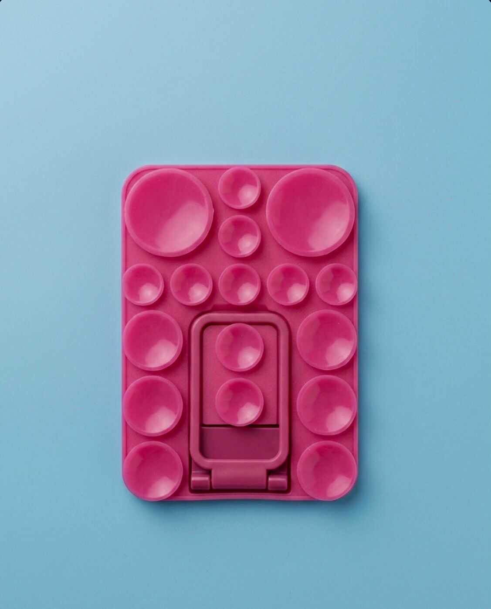
        <h3>Ventosa Rosa pink</h3>
        
R$ 20,00

        <a href="https://wa.me/5592986319253" target="_blank"><button>Comprar</button></a>
    

    

        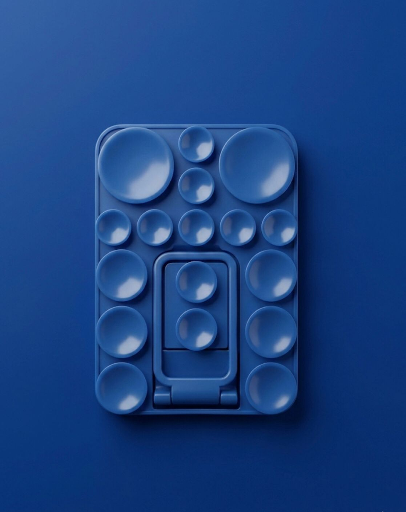
        <h3>Ventosa Azul escuro</h3>
        
R$ 20,00

        <a href="https://wa.me/5592986319253" target="_blank"><button>Comprar</button></a>
    

    

        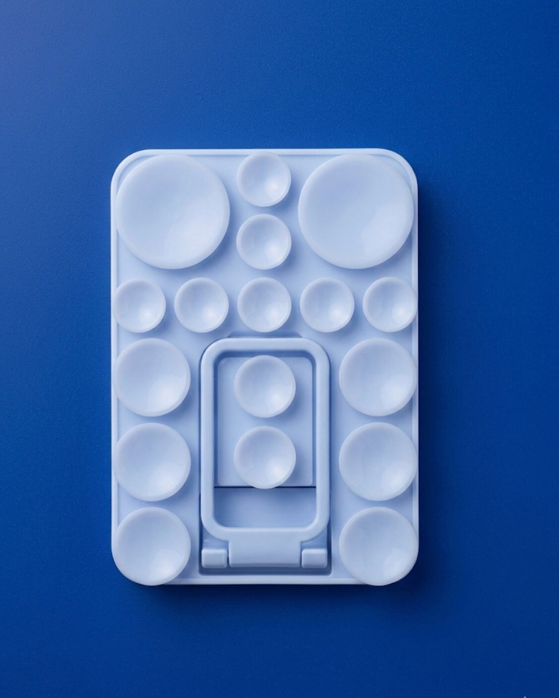
        <h3>Ventosa Azul bebê</h3>
        
R$ 20,00

        <a href="https://wa.me/5592986319253" target="_blank"><button>Comprar</button></a>
    

    

        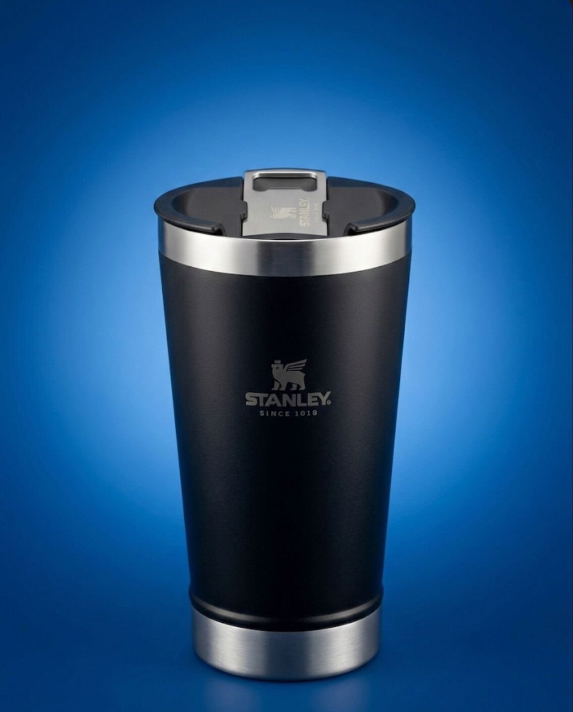
        <h3>Copo Stanley 520ml</h3>
        
R$ 35,00

        <a href="https://wa.me/5592986319253" target="_blank"><button>Comprar</button></a>
    

</section>

<!-- Localização -->
<section class="localizacao">
    <h2>📍 Onde Estamos</h2>
    
Porto de Manaus - AM

    
🕒 Segunda a Sábado: 8h às 18h

    
📱 +55 92 98631-9253

</section>

<a class="whatsapp-fixo" href="https://wa.me/5592986319253" target="_blank">
💬 Fale Conosco
</a>

 <!-- fim content -->
</body>
</html>
